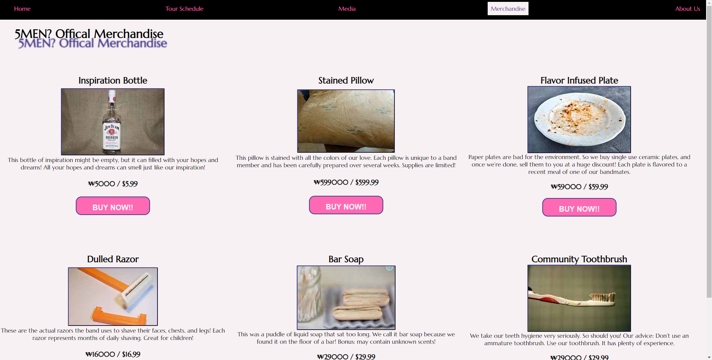

# First group project - Front End - NSS - Cohort E8

This project helps us handle merge conflicts while practicing HTML, CSS, and JS.  We are also practicing creating tickets and processing them through our project board.  We are creating a band website.  We have five pages: Homepage, Tour Schedule, Media, Merchandise, and an About Us page.

## Screenshots





## How to run this project

- Use npm to install http-server in your terminal:

```sh
npm install -g http-server
```

- Run the server

```sh
hs -p 8080
```

- Open your browser and navigate to:

```
localhost:8080
```
